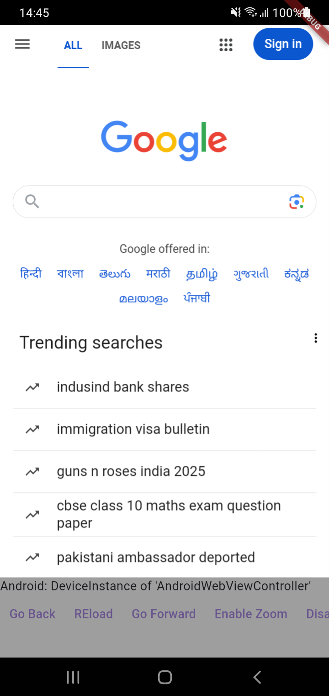
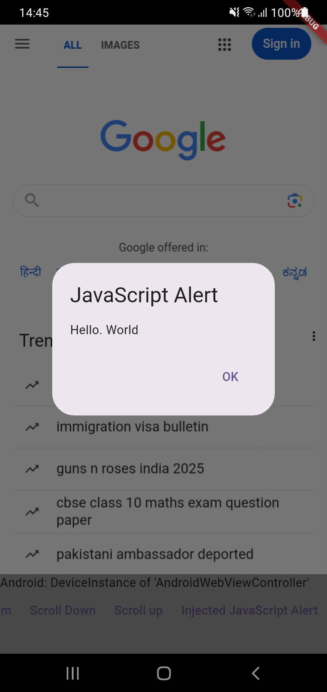
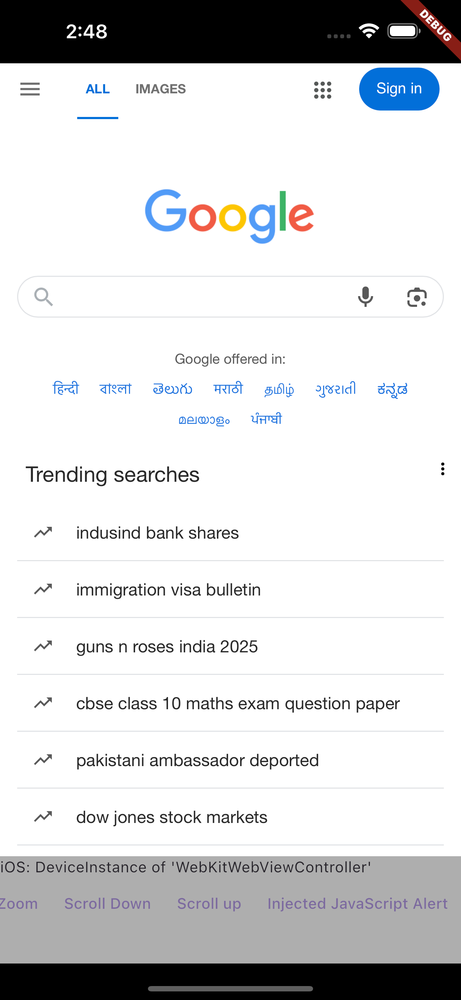

# 📱 flutter_webview_demo

A Flutter project demonstrating the use of **WebView** to load web content within a Flutter app. This project includes:  
✅ WebView implementation using `webview_flutter`  
✅ JavaScript support & event handling  
✅ Platform-specific configurations for Android & macOS

---
## screenshots
<div>
.
.
.
</div>

## References
- [link](https://pub.dev/packages/webview_flutter/versions/4.10.0)
## 🚀 **Features**
- Load and display web pages within a Flutter app.
- Handle JavaScript execution.
- Support for scrolling detection and user interactions.
- Custom navigation buttons (Back, Forward, Reload).
- Android-specific debugging and media playback settings.

---

## 🛠️ **Installation & Setup**
### **1️⃣ Clone the repository**
```sh
git clone https://github.com/vinit-401/flutter_web_view.git
cd flutter_webview_demo
